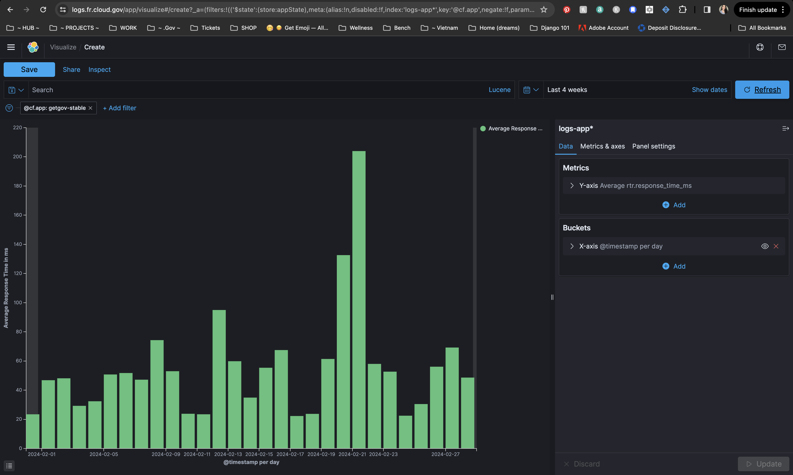

# 24. Production Release Cadence

Date: 2024-14-02

## Status

In Review

## Context

We experienced problems with our Cloudfront caching infrastructure early in our November launch.  In response, we turned off caching across the application.  We would like to utilize caching again without incurring the same issues.

Details:
Originally, Cloudfront was utilized to provide caching capabilities in our application.  All incoming HTTP requests first go through a Cloudfront endpoint, which has a caching infrastructure enabled by default. Cloudfront then decides whether to pass each request to our running Django app inside cloud.gov or if it will respond to with cached data.  The big problem with this feature is Cloudfront's caching has a default timeout of 24-hours, which we cannot control.  This led to issues on our November launch;  Incidents reported include the following...
 - Users couldn't utilize login.gov properly and had to wait a day before they would be able to login.  This was traced back to the 24-hour cache timeout.
 - Changes made by admins would not be reflected in the app (due to the cached data not updating)

To resolve these issues, we added "no cache" headers throughout our application.  Currently, every single HTTP response that comes from Django says "Cache control: no cache" in the headers, which instructs Cloudfront not to cache the associated data.  This effectively removes Cloudfront caching for us.

Although we could leave our architecture as-is, we decided to investigate options for improving our use of caching (instead of just disabling it completely). 

## Considered Options

**Option 1:** Cache static resources using Whitenoise

Caching static resources should pose little risk to our application's functionality.  Currently, every static resource from /public/... is hitting our Django application inside of Cloud.gov. We already use a Django plugin called whitenoise that can do hash-based linking to static assets so that they can be cached forever by Cloudfront. (If the content changes, then the hash changes, then it results in a different filename.)

See ticket [#1371](https://github.com/cisagov/manage.get.gov/issues/1371) for more information. 

**Option 2:** Leave things as-is (we had some discussion on whether or not caching static pages will make enough of a difference to be worth the effort)

## Decision

We decided on Option 2 - leave things as-is (for now).

Preliminary analysis suggest that implementing caching on static pages will result in negligible improvements to our application load time.  A quick look at Kibana logs suggests most of these resources take less than 10ms to load...

If we look at average load times in Kibana (here is [the Kibana page with preloaded query](https://logs.fr.cloud.gov/app/visualize#/create?_a=(filters:!(('$state':(store:appState),meta:(alias:!n,disabled:!f,index:'logs-app*',key:'@cf.app',negate:!f,params:(query:getgov-stable),type:phrase),query:(match_phrase:('@cf.app':getgov-stable)))),linked:!f,query:(language:lucene,query:''),uiState:(),vis:(aggs:!((enabled:!t,id:'1',params:(customLabel:'Average%20Response%20Time%20in%20ms',field:rtr.response_time_ms),schema:metric,type:avg),(enabled:!t,id:'2',params:(drop_partials:!f,extended_bounds:(),field:'@timestamp',interval:d,min_doc_count:1,scaleMetricValues:!f,timeRange:(from:now-20d,to:now),useNormalizedEsInterval:!t),schema:segment,type:date_histogram)),params:(addLegend:!t,addTimeMarker:!f,addTooltip:!t,categoryAxes:!((id:CategoryAxis-1,labels:(filter:!t,show:!t,truncate:100),position:bottom,scale:(type:linear),show:!t,style:(),title:(),type:category)),grid:(categoryLines:!f),labels:(show:!f),legendPosition:right,seriesParams:!((data:(id:'1',label:'Average%20Response%20Time%20in%20ms'),drawLinesBetweenPoints:!t,lineWidth:2,mode:stacked,show:!t,showCircles:!t,type:histogram,valueAxis:ValueAxis-1)),thresholdLine:(color:%23E7664C,show:!f,style:full,value:10,width:1),times:!(),type:histogram,valueAxes:!((id:ValueAxis-1,labels:(filter:!f,rotate:0,show:!t,truncate:100),name:LeftAxis-1,position:left,scale:(mode:normal,type:linear),show:!t,style:(),title:(text:'Average%20Response%20Time%20in%20ms'),type:value))),title:'',type:histogram))&_g=(filters:!(),refreshInterval:(pause:!t,value:0),time:(from:now-2w,to:now))&indexPattern=logs-app*&type=histogram)), it looks like we are doing great for load times in stable (using the rtr.response_time_ms metric), staying under 200ms (in the last 4 weeks) and usually hovering around 40-80ms. Some google searching suggests that "an ideal page load time is between 0-2 seconds, but 3 seconds is also considered to be an acceptable score. Anything above 3 seconds increases the likelihood of visitors leaving your site." (Quote shamelessly copied from Sematex)

NOTE: While we considered implementing caching in a sandbox (See footnote) in order to examine risks and benefits of OPTION 1 in more detail, this incurred more overhead than expected (mainly due to poor documentation).  Therefore, we decided it was not worth the investment.

Therefore, implementing caching using Whitenoise is not currently worth it for the following reasons;
- Minimal gains:  We would only be caching static files which would not result in a large performance boost
- Risks: Incurs risk of unforeseen loading issues (we can’t entirely rule out that we won’t run into issues like we did in our November launch incident). Although we don’t think static files should pose a problem, due diligence would call us to monitor for any unforeseen issues that might arise, which adds cost to this project that doesn’t seem proportional to the gains.
- Maintenance: We would have to provide custom settings in cloudfront (coordinated through Cameron) for any sandboxes and other environments where caching is enabled.  If we move down the route of utilizing CDN, it would be good for every environment to have this service enabled so our dev environments reflect stable settings.  This could possibly introduce some overhead and maintenance issues.  (Although further investigation might reveal these to be negligible.)

Overall, it is recommended that we SHELVE this caching endeavor for a future scenario where we have exhausted other (likely more lucrative) options for performance improvements.  If we then still need to make improvements to our load times, perhaps we can revisit this and examine caching not only static files, but other resources as well (with caution).

## Consequences

We will forgo (negligible) load-time improvements by leaving caching off.

## (Footnote - How to implement caching)
Here are notes for implementing caching using whitenoise should we decide to pick this up again in the future;

1 - Add caching capability to a sandbox using the following steps (or [following documentation for command line](https://cloud.gov/docs/services/external-domain-service/))
- Log-in to the cloud.gov website
- [Navigate to "Services"](https://dashboard.fr.cloud.gov/services).  Click "Add Service"...
- Choose "Marketplace Service"
- For the fields, select Cloud Foundry, Organization = "cisa-dotgov", Space = "[your sandbox. eg. "nl"]".  Click "Next"
- For the Service, select "External Domain".  Click "Next"
- For the Plan, select "domain-with-cdn" (here is [documentation on CDN](https://cloud.gov/docs/management/custom-domains/))
- If you choose to bind the app, a JSON string will be required (we believe this should do it: {"domains": "example.gov"}, where "example.gov" is replaced with the domain name you want to use for this application)
Before you can continue, work with Cameron to setup the DNS in AWS (use the following documentation linked below):
https://cloud.gov/docs/services/external-domain-service/
- Once the DNS is setup, you *should* be able to continue.  We did not test this.

2- Enable caching in the code with Whitenoise (see [documentation on Whitenoise Caching](https://whitenoise.readthedocs.io/en/latest/djangohtml#add-compression-and-caching-support))

3- Take performance measurements before/after caching is enabled to determine cost-benefits of implementing caching. (NOTE: [lighthouse](https://developer.chrome.com/blog/lighthouse-load-performance) might be useful for this step)
